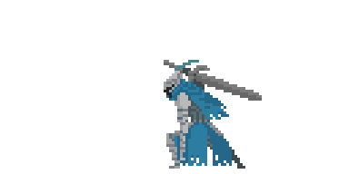

 

 

 

 

 

 

<strong>
"I am a Hybrid Professional. As a Front-End Developer, I specialize in React.js and Next.js, building scalable web apps. As a Skilled Laborer (H-2A), I bring 10+ years of resilience and practical experience in agriculture and construction. I combine technical vision with a strong work ethic."
</strong>

 

 

 

 

<strong>
💻 Languages:  
 

 
⚛️ Frameworks & Libraries:  
 

 
🛠️ Tools & Build:  
 

 
🎨 Design & UI/UX  
 

</strong>

 

 

 

 
 

 

